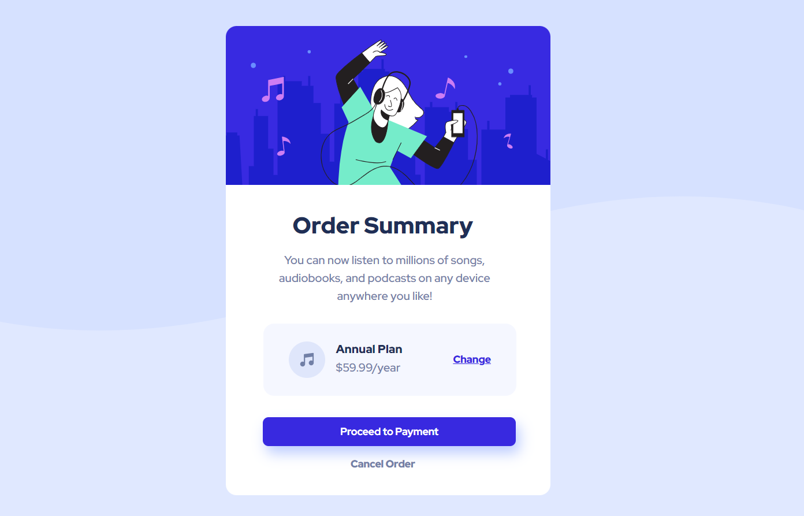

# Projeto Frontend Mentor - Order Summary Component Main

Este é mais um desafio de um card para iniciantes do Frontend Mentor.

[] (https://github.com/Geicimara-nunes/order-summary.git)

## O Projeto

Um cartão com responsivo e elementos interativos com hover.

[]

 []

### Linguagens utilizadas 

- HTML

- CSS